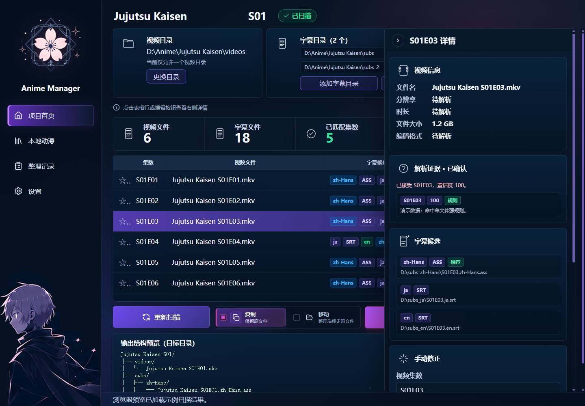
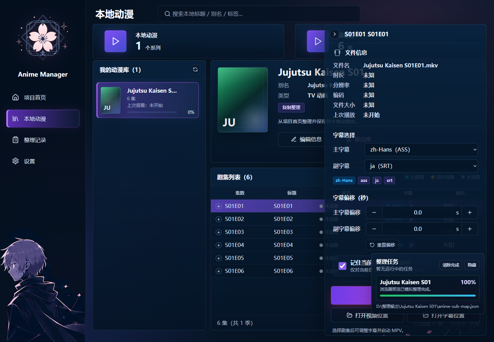

# Anime Subtitle Manager 操作手册

Anime Subtitle Manager 是一个面向 Windows 的本地动漫视频与字幕整理工具。当前核心工作流分为两个页面：

- **项目首页**：选择视频目录、字幕目录和输出目录，扫描匹配结果，整理文件，并保存到本地动漫库。
- **本地动漫**：查看已经保存的动漫库记录，选择剧集、字幕轨道和字幕偏移，然后启动 MPV 播放。

> 确保 mpv.exe 已经在系统 PATH 中

## 1. 项目首页



项目首页用于完成“扫描 → 确认 → 整理 → 保存到本地动漫”的完整流程。

### 操作顺序

1. **填写项目名称与季**
   - 在顶部输入项目名称，例如 `Jujutsu Kaisen`。
   - 确认季字段，例如 `S01`。
   - 输出文件会按 `<项目名称> <季>` 生成目录。

2. **选择视频目录**
   - 点击“视频目录”区域的“更换目录”。
   - 选择包含 `.mkv` 或 `.mp4` 的视频文件夹。
   - 当前版本一次只使用一个视频目录。

3. **添加字幕目录**
   - 点击“字幕目录”区域的“添加字幕目录”。
   - 可添加多个字幕目录。
   - 支持 `.ass`、`.ssa`、`.srt`、`.vtt`。
   - 如果添加错了，可以点击“清空”重新选择。

4. **选择输出目录**
   - 点击“输出目录”区域的“更换目录”。
   - 程序会在该目录下生成类似 `Jujutsu Kaisen S01/` 的整理结果目录。

5. **开始扫描**
   - 点击“开始扫描”。
   - 扫描完成后，表格会显示每一集的视频、字幕候选、字幕数量和匹配状态。

6. **检查匹配结果**
   - 点击表格行或编辑按钮，在右侧详情面板查看当前集。
   - 重点检查：
     - 集数是否正确。
     - 主字幕是否是目标语言。
     - 副字幕是否正确。
     - 是否存在冲突或缺失。
   - 如有问题，在“手动修正”区域调整视频、主字幕、副字幕，然后点击“应用修正”。

7. **选择整理模式**
   - 选择“复制”：原文件保留在原目录。
   - 选择“移动”：整理后源文件会被移走。
   - 建议首次整理先使用“复制”。

8. **开始整理**
   - 点击“开始整理”生成整理计划。
   - 确认源路径、目标路径和冲突处理方式。
   - 点击“确认执行”后开始复制或移动文件。

9. **保存到本地动漫**
   - 整理完成后，点击“保存到本地动漫”。
   - 保存后，该项目会出现在“本地动漫”页面。

### 输出结构

整理后会生成如下结构：

```text
<Anime Name> <Season>/
├─ videos/
│  ├─ <Anime Name> S01E01.mkv
│  └─ ...
├─ subs/
│  ├─ zh-Hans/
│  │  ├─ <Anime Name> S01E01.zh-Hans.ass
│  │  └─ ...
│  ├─ ja/
│  │  ├─ <Anime Name> S01E01.ja.srt
│  │  └─ ...
│  └─ und/
│     └─ ...
└─ anime-sub-map.json
```

`anime-sub-map.json` 是该整理目录内部的映射文件。本地动漫库列表本身由应用数据目录中的 `anime-library.json` 管理。

## 2. 本地动漫



本地动漫页面用于查看已经保存到库中的项目，并从 GUI 启动 MPV。

### 操作顺序

1. **打开本地动漫页面**
   - 在左侧导航点击“本地动漫”。
   - 页面会加载本地动漫库记录。
   - 如果刚在项目首页保存过项目，页面会自动同步该记录。

2. **刷新或搜索动漫**
   - 点击库列表右上角的刷新按钮，可重新读取本地动漫库。
   - 使用顶部搜索框按标题筛选条目。

3. **选择动漫条目**
   - 在“我的动漫库”列表中点击一个条目。
   - 右侧会显示项目名称、别名、类型、整理模式、简介和剧集列表。

4. **维护库记录**
   - 点击“编辑信息”可补充条目的展示信息。
   - 点击“移出库”只会从本地动漫库移除记录，不会删除本地视频或字幕文件。

5. **选择剧集**
   - 在剧集列表中点击目标集数。
   - 页面右侧会显示该集的视频文件信息、字幕选择和播放控制。

6. **选择主字幕和副字幕**
   - 在“主字幕”下拉框选择要作为第一字幕的文件。
   - 在“副字幕”下拉框选择要作为第二字幕的文件。
   - 也可以选择“不使用”。

7. **调整字幕偏移**
   - 在“字幕偏移（秒）”区域设置主字幕和副字幕偏移。
   - 正数表示字幕延后，负数表示字幕提前。
   - 可点击“重置偏移”恢复为 `0`。
   - 如果勾选“记住当前目录的字幕偏移”，该偏移会按目录保存。

8. **启动 MPV**
   - 确认 MPV 路径已在设置页配置，或系统 PATH 中存在 `mpv`。
   - 点击“用 MPV 播放”。
   - 程序会传入当前视频、最多两个字幕文件以及对应偏移。

9. **打开文件位置**
   - 点击“打开视频位置”可在资源管理器中定位视频。
   - 点击“打开字幕位置”可定位当前选择的字幕。

### 本地动漫库文件

本地动漫页读取的是应用数据目录下的统一库文件：

```text
anime-library.json
```

启动 Tauri 程序时，控制台会打印实际路径：

```text
local_library_file = ...
```

该文件记录已经保存到本地动漫库的项目、剧集、视频路径、字幕路径、观看进度和字幕偏移等信息。
